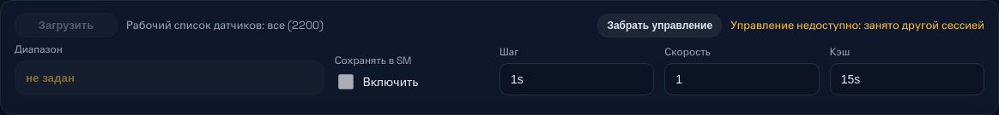
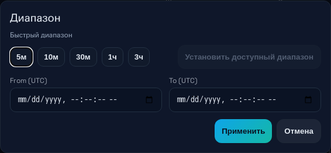
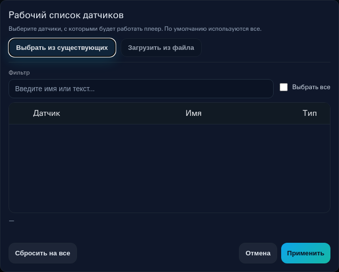
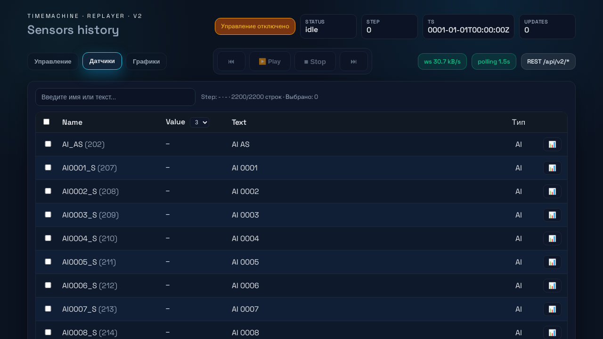
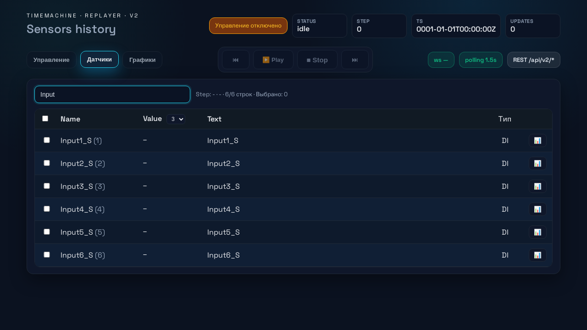
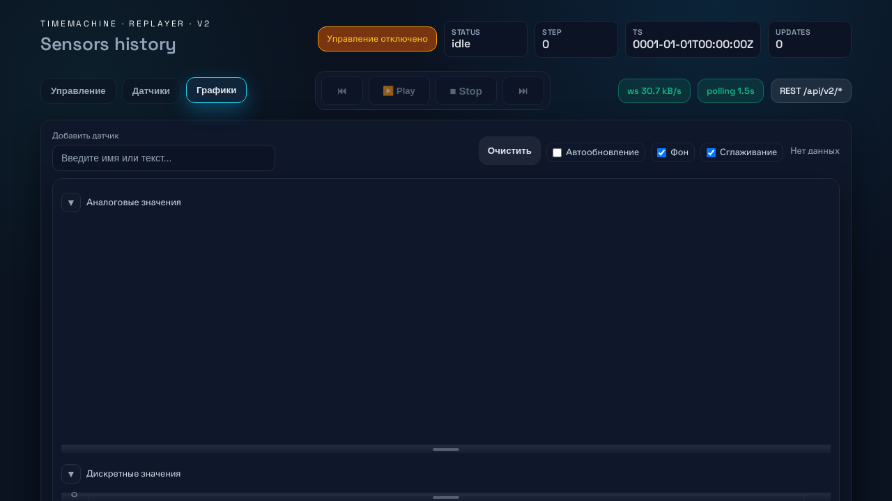
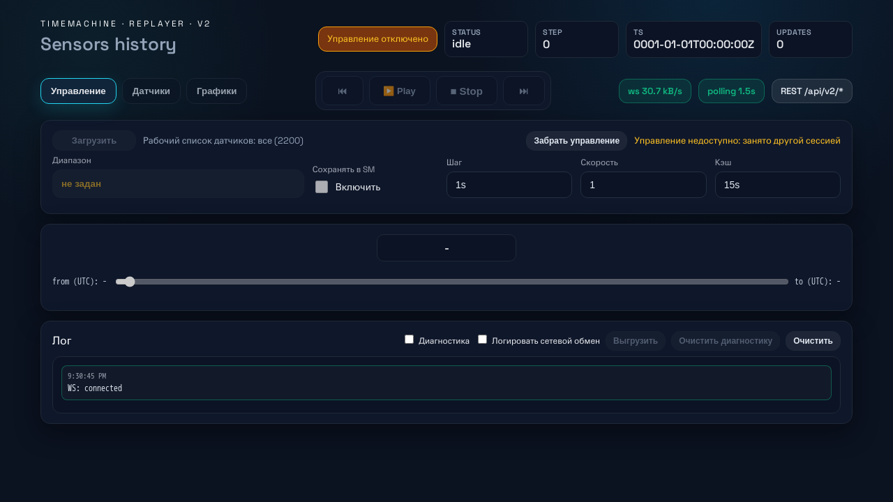

# Руководство по интерфейсу TimeMachine

TimeMachine предоставляет веб-интерфейс для управления воспроизведением исторических данных датчиков. Интерфейс доступен по адресу `http://localhost:9090/ui/`.

## Оглавление

- [Общий обзор](#общий-обзор)
- [Панель управления](#панель-управления)
- [Таблица датчиков](#таблица-датчиков)
- [Графики](#графики)
- [Диалоги](#диалоги)

---

## Общий обзор

Интерфейс разделён на три вкладки:
- **Управление** — основная панель с элементами управления воспроизведением
- **Датчики** — таблица со значениями всех датчиков
- **Графики** — визуализация данных в виде графиков

В верхней части отображаются индикаторы состояния:
- **WS** — статус WebSocket-соединения (зелёный = подключено)
- **Диапазон** — текущий диапазон воспроизведения
- **Статус** — текущее состояние (idle/running/paused/done)

---

## Панель управления

### Элементы управления

| Элемент | Описание |
|---------|----------|
| **Play/Pause** | Запуск или приостановка воспроизведения |
| **Stop** | Полная остановка воспроизведения |
| **Step** | Шаг вперёд/назад на один интервал |
| **Seek** | Перемотка на указанный шаг |
| **Скорость** | Множитель скорости воспроизведения (0.1x — 10x) |

### Установка диапазона

Нажмите кнопку **"Установить доступный диапазон"** для открытия диалога выбора временного диапазона.

В диалоге можно:
- Выбрать начальную и конечную дату/время
- Установить шаг воспроизведения
- Выбрать скорость

### Рабочий список датчиков

Кнопка **"Загрузить"** открывает диалог выбора датчиков для рабочего списка.

Можно:
- Выбрать датчики из существующего списка
- Загрузить список из файла
- Отфильтровать по имени или тексту

---

## Таблица датчиков

Таблица отображает все датчики с их текущими значениями. Используется виртуальный скроллинг для эффективной работы с большим количеством датчиков (2000+).

### Колонки таблицы

| Колонка | Описание |
|---------|----------|
| **Checkbox** | Выбор датчика для групповых операций |
| **Name** | Имя датчика (с ID в скобках) |
| **Value** | Текущее значение |
| **Text** | Текстовое описание датчика |
| **Тип** | Тип датчика (DI/DO/AI/AO) |
| **График** | Кнопка добавления на график |

### Фильтрация

Введите текст в поле поиска для фильтрации датчиков по имени или описанию.

### Точность отображения

Выпадающий список в заголовке колонки **Value** позволяет выбрать количество знаков после запятой (0-8).

### Выделение изменений

Строки с недавно изменившимися значениями (последние 4 секунды) подсвечиваются.

---

## Графики

Вкладка графиков позволяет визуализировать данные датчиков в реальном времени.

### Добавление датчика на график

1. Введите имя датчика в поле поиска
2. Выберите датчик из появившегося списка подсказок
3. Или нажмите кнопку **📊** в таблице датчиков

### Управление графиками

| Элемент | Описание |
|---------|----------|
| **Очистить** | Удалить все датчики с графика |
| **Автообновление** | Включить/выключить автоматическое обновление |
| **Заливка** | Показать/скрыть заливку под линией |
| **Точки** | Показать/скрыть точки данных |
| **Сглаживание** | Включить/выключить сглаживание линий |

### Легенда

Под графиком отображается легенда с:
- Цветом линии
- Именем датчика
- Текущим значением
- Кнопкой удаления

### Масштабирование

- **Колесо мыши** — масштабирование по вертикали
- **Shift + колесо** — масштабирование по горизонтали
- **Перетаскивание** — панорамирование

---

## Лог событий

В нижней части панели управления отображается лог событий:
- Подключения/отключения WebSocket
- Ошибки API
- Изменения состояния воспроизведения

---

## Горячие клавиши

| Клавиша | Действие |
|---------|----------|
| **Space** | Play/Pause (когда фокус не в поле ввода) |
| **Escape** | Закрыть диалог / Очистить фильтр |
| **←/→** | Шаг назад/вперёд |

---

## Советы по использованию

1. **Большое количество датчиков**: Таблица использует виртуальный скроллинг — можно работать с 100000+ датчиков без потери производительности.

2. **Фильтрация**: Используйте фильтр для быстрого поиска нужных датчиков.

3. **Рабочий список**: Ограничьте рабочий список только нужными датчиками для уменьшения нагрузки.

4. **Графики**: Не добавляйте слишком много датчиков на один график — это может замедлить рендеринг.

5. **Скорость воспроизведения**: При работе с большими объёмами данных используйте меньшую скорость для стабильности.
